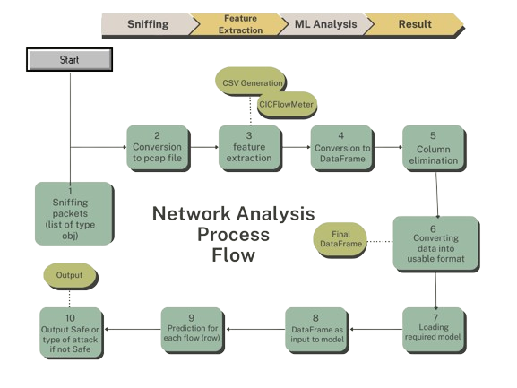
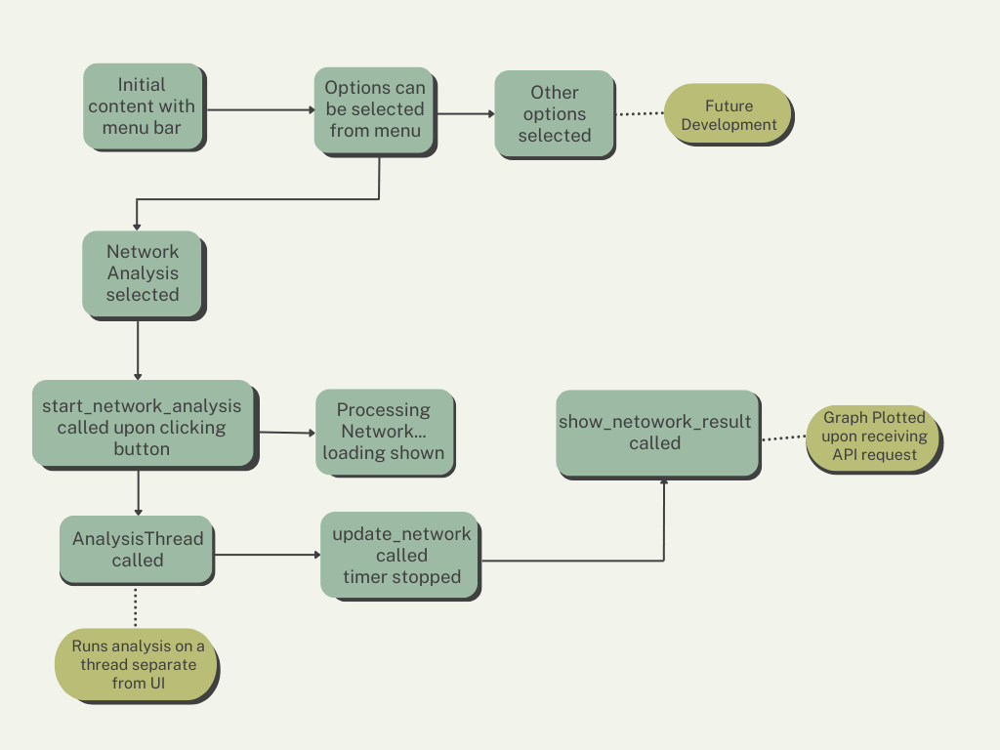

# Network-Analysis-using-ML
Intrusion Detection of Network using Machine Learning with Python

# Official documentation for CyPHER

Please be advised that this is a project undertaken by second-year students of Computer Science and Engineering (CSE) and is not intended as a comprehensive application; rather, it serves as an educational endeavour. Our efforts aim to provide practical experience and application of theoretical knowledge within the scope of our academic curriculum and research done till date. It is crucial to recognize that this project is primarily an educational exercise and may not attain the standards or functionality associated with a fully developed application. Your understanding of this educational focus is greatly appreciated. 

# Usage:
Our software serves as a robust tool for analysing network traffic, evaluating its safety, and identifying potential threats such as DDoS, SSH, Web attacks, BotNet, Infiltration, and Heartbleed. Upon system boot, the software initiates a packet sniffing phase for 60 seconds every ten minutes. The collected data is then processed through an API hosted on a complimentary server.
Please be aware that the analysis may require some time, as our software is provided free of charge and relies on a free server for hosting.
The real-time analysis of 60 seconds every 10 minutes can be stopped by simply clicking on “Stop real-time analysis”
In addition to its primary network analysis capabilities, our software includes an advanced feature designed to detect newly connected external drives. Upon detecting a new external drive, users will receive a notification prompting them to either initiate a scan or skip the scanning process. This feature encourages users to exercise caution when interacting with files on the detected external drive, ensuring a thorough assessment of its safety status. It serves as a proactive measure to identify and address potential security concerns associated with external drives deemed "potentially" unsafe.
As for now this has only been developed for WINDOWS systems only.

# Working:
Here we will talk about the brief understanding of how the software works and all the modules/dependencies used to build the software.
 
 
 
The diagram above, a flowchart, simplifying the Network analysis process flow into 10 steps. 
Using the python module scapy, we were able to capture packets for a specified duration, here                                                                                                                      in this case 60 secs, by interacting with the OS kernel to set up packet capture. Mainly interact-ing with Data-Link Layer and Network Layerconsidering the OSI model. The captured packets are parsed and extracting necessary information, returning a list of Packet objects which are then save to a file in the libpcap format, hence converting the List of Packet Objects to a pcap file. The pcap file is then analyzed by CICFlowMeter, mainly for feature extraction. It reads pcap files containing captured network traffic; for each packet, it analyzes the source and destination addresses, creating bidirectional flows (bi-flows) representing the communication between two endpoints. 
CICFlowMeter creates unique “flow-key” for each bi-directional flow using the Source IP, Dest IP, Source Port, Dest Port, and Protocol. By analysing packets that have the same “flow key” are grouped together into the same bi-flow. This creates a continuous representation of the communication between two endpoints. Hence, to put it in simpler terms CICFlowMeter provides a higher-level view of network traffic as flows instead of a long list of packets. 
The CSV generated by CICFlowMeter, where each row represents a flow and each column is a different feature of the flow, is converted into a pandas DataFrame. Next, the columns which are not required are dropped and further the DataFrame is converted into a more usable format by replacing infinity values with 0, filling NaN values with 0, etc. 
Next, the DataFrame goes through a loop where each flow(row) is analysed and predicted by a pre-trained model accordingly 

# Code Flow:

# How to download:
Website: TBA
To download and install our software on a Windows system, please follow these steps:
## 1.	Access the Download Page:
Scroll down on our website until you find the "Download for Windows ↓" button. Click on the button to initiate the download of a zip file. Or simply download the zip file from git-hub.
## 2.	Extract Files:
After downloading, extract the contents of the zip file. Locate the executable file named cypher_py.exe, which serves as the main program.
## 3.	Install WinPcap:
In the extracted files, find the "WinPcap_4_1_3.exe" file. Execute this file to launch the installation wizard for WinPcap. Follow the instructions provided by the wizard to complete the installation of WinPcap.
## 4.	Configure Java Runtime Environment:
Before using the main software, ensure that the Java Runtime Environment (JRE) variable is set up on your system. Follow these steps:
Set Up Java Environment Variable (Windows 11):

### a.	Verify JRE Installation:
Confirm that Java is installed on your system. If not, download and install the latest version from the official Java website.

### b.	Access Environment Variables:
•	Click on the Start button and select "Settings."
•	In the Settings window, click on "System," and then choose "About."
•	Scroll down and click on "Advanced system settings."
•	In the System Properties window, click the "Environment Variables" button.

### c.	Add Java Installation Path to PATH:
•	Under the "System variables" section, locate and select the "Path" variable, then click "Edit."
•	Click "New" and add the path to your Java installation directory (e.g., C:\Program Files\Java\jdk1.8.0_281\bin).
•	Click "OK" to close each window.

### d.	Verify Configuration:
Open a new Command Prompt window and type java -version to ensure that the Java environment variable is set up correctly. You should see information about your installed Java version.

# You are now ready to use the main software. Execute Detect.py to launch the application.                                                                            
